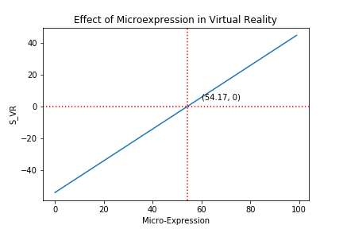

*Figure 1*

*Figure 2*

Comparing Figure 1 and 2, we found that headpose and microexpression has a linear relationship. Due to the method data is generated(leading to a slope of 1), we can only analyze based on the Y-intercept, which is 12.34 for Figure 1, 23.45 for Figure 2. This indicates that MicroExpression has a heavier impact in Virtual reality than Headpose does in Hologram.   

*Figure 3*

In comparison to decrease in MicroExpression, decrease in gesture does not lead to significant user reflection in Virtual Reality. When Gesture is limited from 0 - 20, we can see that Virtual Reality can still be topped to nearly 100. While if we limit MicroExpression to 0 - 20, the increase in Gesture does not lead to significant increase in Virtual Reality, in fact, it is topped at around 25.
 
