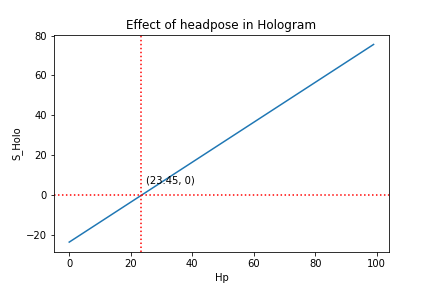
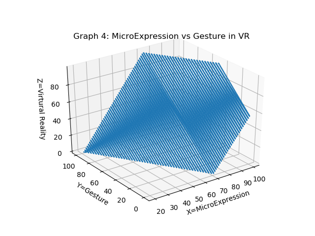

## Equations
<br>

## Graphical Analysis
### 2D Graphical Analysis
<br>
*Figure 1*<br>
<br>
*Figure 2*<br>

Comparing Figure 1 and 2, we found that headpose and microexpression has a linear relationship. Due to the method data is generated(leading to a slope of 1), we can only analyze based on the Y-intercept, which is 12.34 for Figure 1, 23.45 for Figure 2. This indicates that MicroExpression has a heavier impact in Virtual reality than Headpose does in Hologram.  <br>


### 3D Graphical Analysis
<br>
*Figure 3(disregarding video conferencing)*<br>

In comparison to decrease in MicroExpression, decrease in gesture does not lead to significant user reflection in Virtual Reality. When Gesture is limited from 0 - 20, we can see that Virtual Reality can still be topped to nearly 100. While if we limit MicroExpression to 0 - 20, the increase in Gesture does not lead to significant increase in Virtual Reality, in fact, it is topped at around 25.

When analysing the equation   
``` 141.83 = 2 * M + G - Svr ```
The variable ``` M ``` indeed has a slope of 2, indicating its higher impact than gesture.
<br>
<br>
*Figure 4*<br>


<br>
*Figure 5*<br>


<br>

<br>
<br>
<br>
<br>
<br>
<br>
<br>


## Numerical Analysis

### Variable relationship
#### Relationship between variables <br>
<b>Input: </b>
```
from sympy import *

M, G, S, Hp, Holo, VR, Vi = symbols('M G S Hp Holo VR Vi')
res = solve([Eq(M+G+S+Holo,76.55),
             Eq(G+S+Hp+VR,45.83),
             Eq(M+G+Vi,87.66),
             Eq(M+G+S+Hp,100),
            ],
            [M, G, S, Hp, Holo, VR, Vi])
print(res)
```
<b>Output:</b> <br>{Hp: Holo + 23.45, S: -Holo + Vi - 11.11, G: -VR - Vi + 33.49, M: VR + 54.17}


##### Comments
It is natural that in an underdetermined problem, we found variables to be dependent. What is interesting is to compare the Y-interception for Micro-expression in VR, Headpose in Hologram, and to construct other 3D graphs. These graphs might reveal some innate insights

<br>
<br>
#### Least Square Estimate of Underdetermined Problem <br>
<br> Input: </b> <br>
```
import numpy as np
import matplotlib.pyplot as plt
from scipy.sparse.linalg import lsqr
A = np.array([[1,1,1,0,1,0,0],
              [0,1,1,1,0,1,0],
              [1,1,0,0,0,0,1],
              [1,1,1,0,0,0,0],
             ])

b = np.array([76.55,45.83,87.66,100])

result = lsqr(A,b)
```
<br> Output: </b> <br>
```
solution = [ 41.37153846  34.97230769  23.65615385  -6.39923077 -23.45  -6.39923077  11.31615385]
stopping reason(1 means approximate solution to Ax=b, 2 means x approximately solved the least square problem): 1
r1norm: 4
r2norm: 2.1644639758710023e-12
anorm(Estimate of Frobenius norm of Abar = [[A]; [damp*I]].): 2.1644639758710023e-12
acond(Estimate of cond(Abar).): 3.741657386773941
arnorm(Estimate of norm(A'*r - damp^2*x)): 7.337993857053426
xnorm(norm(x)): 6.724908469831543e-12
```

##### Comments
The solution estimate the underdetermined equation by using Least Square, and the result shows that   
M =~ 41.37 <br>
G =~ 34.97 <br>
S =~ 23.66 <br>
Hp =~ -6.40 <br>
Holo =~ -23.45 <br>
VR =~ -6.40 <br>
Vi =~ 11.32 <br>

This result demonstrated a few interesting points:  
1. Microexpression and Gesture have impact magnitude larger than that of any settings, implying that Microexpression and Gesture is more important than any impacts given by the different settings
2. Microexpression has the biggest impact overall, regardless of the medium the experiement was conducted over.
3. Hologram has the most negative impact overall
4. Video conferencing is the only setting that has positive impact on user experience
5. Headpose has negative, however comparatively low, effect on user experience
6. Virtual Reality setting has negative, however comparatively low, effect on user experience


Conclusion for future developers:
1. For any platforms, focus on microexpression and gesture because they have the most significant positive impact.


Sidenote:
1. It might be due to the way that we carried out Holographic setting that lead to a distorted result.
